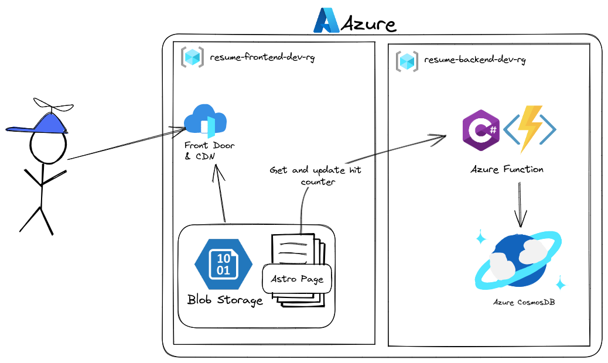

# Cloud Resume Website

This is the repository of my resume website [soerenchrist.de](https://soerenchrist.de).
It is built with
- [Astro](https://astro.build) on the frontend (SSG) using this [template](https://astro-modern-personal-website.netlify.app/)
- C# in an [Azure Function](https://learn.microsoft.com/en-us/azure/azure-functions/functions-overview) for the visitor count
- [CosmosDB](https://azure.microsoft.com/de-de/products/cosmos-db) as data storage
- Azure Blob Storage to store the static website
- [Terraform](https://terraform.io) and Terraform Cloud for automating Azure infrastructure provisioning
- [GitHub Actions](https://github.com/features/actions) for CI/CD pipeline

This project is following the [Cloud resume challenge](https://cloudresumechallenge.dev/) to get hands-on experience with cloud concepts like serverless or Terraform.

## Architecture


This diagram shows the structure of the infrastructure for the development environment. There is also essentially a copy in a separate Azure subscription for production. 

## What tools you'll need
- Azure account
- GitHub account
- (Optional) Terraform Cloud account
- Azure CLI Tool
- Azure Function Core Tools
- Dotnet CLI

## Get Started

### Get the code
1. Fork the repository so you have your own copy of it
2. Clone the code or open a GitHub Codespace

### Authenticate the environment with Azure
1. In the Terminal, type `az login --use-device-code` to log into your Azure account from the az cli
2. In the Terminal, type `az account list --output table` to get a list of Azure subscriptions you have
3. In the Terminal, type `az account set --name "name-of-subscription"`
4. In the Terminal, type `az account show` and make sure it is set to the subsctiption you want to work in

### Provisioning to azure
I have provided Terraform files as Infrastructure as Code (IaC) that are located in the `terraform` directory.
1. In the Terminal, move to the `terraform` directory by typing `cd terraform`
2. Initialize the terraform environment with `terraform init`
3. Using `terraform plan` terraform will check your azure account and will output all the changes it will have to make
4. Apply those changes by executing `terraform apply` and make sure to confirm by typing `yes` when asked. Terraform will now go ahead and create all the resources in your azure subscription.

### Upload the azure function
To deploy the azure function to the provisioned infrastructure there are two ways. If you use bash, you can just execute the provided script file: 
```
./scripts/publish-function.sh
```

This will use the Azure Function Core Tools to build the code and push it to the correct destination in Azure.


Alternatively you can directly use the Azure Function CLI with:
```
func azure functionapp publish <FUNCTION_APP_NAME>
```

### Upload the website
To upload the static site to the Azure Blob Storage there is also a provided script, which will perform the needed steps:
```
./scripts/upload-static-page.sh
```

Alternatively, you will have to build the frontend code using 
```
npm install
npm run build
```

and then upload the resulting HTML, JS and CSS files by using the Azure CLI tool:

```
az storage blob upload-batch -s frontend/dist -d '$web' --account-name <STORAGE_ACCOUNT_NAME>
```

As a result, the app is completely provisioned to azure. To find the URL of the uploaded website you can use the command

```
az storage account show -n <STORAGE_ACCOUNT> -g <RESOURCE_GROUP> --query "primaryEndpoints.web" 
```

## The CI/CD pipeline
My pipeline is set as following:
- When making changes in my local development environment I will work in my Azure development subscription and dev environment.
- To deploy the changes to production, I have to create a pull request to the main branch
    - On this pull request, a GitHub Action will run a `terraform plan` to check, which affects this code change will have and will add this info to the PR
- When the PR is merged, the Action is started again, but this time the following steps are performed:
    - Terraform will this time `apply` the changes to the production environment
    - After the provisioning, the action will build the backend and push the code to the Azure Function
    - Last the frontend is built and uploaded and the CDN will be purged
